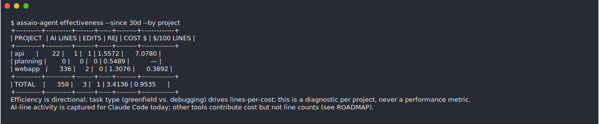

<div align="center">

# assaio

**Is your AI coding spend delivering? `assaio` shows which projects turn AI budget into
code — and where the same spend would go further — fully offline today, across Claude
Code, Codex, Gemini CLI, and Cline. The first piece of a self-hosted AI-engineering
analytics platform.**

[](https://github.com/assaio/assaio/actions/workflows/ci.yml)
[](https://goreportcard.com/report/github.com/assaio/assaio)
[](https://pkg.go.dev/github.com/assaio/assaio)
[](LICENSE)
[](https://github.com/assaio/assaio/releases)

[assaio.dev](https://assaio.dev) · [Roadmap](ROADMAP.md) · [Backlog](BACKLOG.md) · [Features](FEATURES.md) · [Privacy](PRIVACY.md) · [Contributing](CONTRIBUTING.md)

</div>

---

Teams pour real money into AI coding tools and can't answer the question that actually
matters: **is it delivering?** Vendor dashboards count tokens and dollars — spend, never
output — and each is a per-vendor silo with weeks-long retention that never adds up
across the tools your engineers really use. `assaio` reads the session logs already
sitting on your machine and puts AI output *over* its cost: per project, how much code
AI produced, how efficiently (**`$` per 100 AI lines** — the headline), and with how much
friction — so you can see which projects turn spend into code and which mostly burn it.
Fully offline today, no account, no upload, in about 60 seconds. Cost is the denominator
now, not the headline.

<p align="center">
  
</p>

## Privacy first

`assaio` is built to be safe to run on a work machine without asking anyone's
permission. This section describes the **v0.1 local agent** — the only thing that ships
today.

- **No network at runtime.** The price table is embedded into the binary at build time.
  Nothing is fetched, posted, or phoned home.
- **No telemetry.** No usage pings, no analytics, no crash reporting.
- **Prompts and code are never read.** The parsers extract token counts, model names,
  timestamps, session IDs, and activity counts (lines added/removed, edits, rejections) —
  **never prompt text, never file contents.** Line counts come from diff `+`/`-` markers;
  the code on those lines is counted, never stored.
- **Your data stays local.** Everything lives in one SQLite file under your home
  directory. `clear --all --yes` deletes it.

Full detail, including the exact fields extracted: [PRIVACY.md](PRIVACY.md).

**The optional team server.** v0.1 also ships an early, self-hostable team server:
`assaio-agent serve` pools a team's usage in one place and `assaio-agent sync` pushes each
member's records to it, with a per-member team dashboard. Running it uses the network — the
offline guarantee above is about the local analysis — and it talks only to infrastructure
you stand up. Team views stay aggregated and pseudonymized by default; a per-member view is
a deliberate, governed opt-in, never a surveillance leaderboard. The **deeper** work —
correlating with git and issue trackers for survival / bug / quality — is still ahead. Both
documents cover this in full: [PRIVACY.md](PRIVACY.md), [ROADMAP.md](ROADMAP.md).

## Install

`assaio-agent` is a single static binary — no CGO, no runtime dependencies — built for
macOS, Linux, and Windows (amd64/arm64), and the test suite runs in CI on all three.

**Homebrew** (macOS, and Linux via Linuxbrew):

```sh
brew install assaio/tap/assaio-agent
```

**Linux / macOS, manual** — grab your platform's archive from
[Releases](https://github.com/assaio/assaio/releases) and put the binary on your
`PATH`, e.g.:

```sh
curl -LO https://github.com/assaio/assaio/releases/download/v0.1.0/assaio_0.1.0_linux_amd64.tar.gz
tar xzf assaio_0.1.0_linux_amd64.tar.gz assaio-agent
sudo install assaio-agent /usr/local/bin/
```

**Windows** (PowerShell) — download the zip, unpack, add to `PATH`:

```powershell
Invoke-WebRequest https://github.com/assaio/assaio/releases/download/v0.1.0/assaio_0.1.0_windows_amd64.zip -OutFile assaio.zip
Expand-Archive assaio.zip -DestinationPath "$env:LOCALAPPDATA\assaio"
[Environment]::SetEnvironmentVariable("Path", "$([Environment]::GetEnvironmentVariable('Path','User'));$env:LOCALAPPDATA\assaio", "User")
```

(New terminal after the `PATH` change; on ARM replace `amd64` with `arm64`. Scoop and
winget packages are on the [backlog](BACKLOG.md).)

**Any platform, with Go 1.25+:**

```sh
go install github.com/assaio/assaio/cmd/assaio-agent@latest
```

Every release artifact ships with checksums and a build-provenance attestation —
verify one with `gh attestation verify <archive> -o assaio`.

New here? `assaio-agent demo` prints the full reports on bundled sample data — no logs
needed — so you can see the value before importing your own history.

## Quick start

The commands below are identical on macOS, Linux, and Windows (PowerShell or cmd) —
each tool's log location is auto-detected per OS, and `assaio-agent doctor` shows
exactly what was found on your machine.

Import your local history, then report on it. The first `backfill` reads every session
log your AI coding tools have written — often months of data.

```console
$ assaio-agent backfill
claude-code   files=3  records=4  inserted=4
codex         files=1  records=1  inserted=1
gemini-cli    files=0  records=0  inserted=0
cline         files=0  records=0  inserted=0
```

First, where the money goes — spend per project:

```console
$ assaio-agent report --since 30d --by project
+----------+-------+-------+---------+---------+--------+--------+
| PROJECT  |    IN |   OUT | CACHE R | CACHE W | CACHE% | COST $ |
+----------+-------+-------+---------+---------+--------+--------+
| api      | 22680 | 16800 | 1664000 |   38000 |   98.7 | 1.5572 |
| planning |   270 |  7300 |  430000 |   24000 |   99.9 | 0.5489 |
| webapp   |  1720 | 15000 |  848000 |   80000 |   99.8 | 1.3076 |
+----------+-------+-------+---------+---------+--------+--------+
|          |       |       |         |         | TOTAL  | 3.4136 |
+----------+-------+-------+---------+---------+--------+--------+
```

But spend is only half the question. **Which projects turn that spend into code, and
which don't?** That is `effectiveness` — AI output over cost, per project:

```console
$ assaio-agent effectiveness --since 30d --by project
+----------+----------+-------+-----+--------+-------------+
| PROJECT  | AI LINES | EDITS | REJ | COST $ | $/100 LINES |
+----------+----------+-------+-----+--------+-------------+
| api      |       22 |     1 |   1 | 1.5572 |      7.0780 |
| planning |        0 |     0 |   0 | 0.5489 |           — |
| webapp   |      336 |     2 |   0 | 1.3076 |      0.3892 |
+----------+----------+-------+-----+--------+-------------+
| TOTAL    |      358 |     3 |   1 | 3.4136 | 0.9535      |
+----------+----------+-------+-----+--------+-------------+
Efficiency is directional: task type (greenfield vs. debugging) drives lines-per-cost; this is a diagnostic per project, never a performance metric.
AI-line activity is captured for Claude Code and Codex today; Gemini CLI and Cline contribute cost but not line counts (see ROADMAP).
Cost is an estimate at public pay-as-you-go API prices -- not your actual spend; subscription plans bill a flat rate and differ.
```

The headline column is **`$/100 LINES`** — cost per 100 AI-written lines. Read this table:

- **`webapp`** turns spend into code: greenfield work, 336 AI lines at **`$0.39` per 100
  lines**.
- **`api`** costs **`$7.08` per 100 lines — 18× more.** It is debugging-heavy: many
  tokens spent reading and reasoning, few new lines — so the ratio reads worse.
- **`planning`** shows **`—`**: real cost, zero lines. That is an architecture session,
  not waste — so `assaio` prints an honest blank, never a fake `$0` or a divide-by-zero.

This is a **per-project diagnostic, not a scoreboard.** The ratio is directional: task
type drives lines-per-cost far more than any person does, which is why `assaio` groups by
project here, not by author, by default.

Group by `day`, `project`, `tool`, `model`, or `entrypoint`. Want machine-readable
output? Add `--format json` or `--format csv`. Not sure what was detected? Run
`assaio-agent doctor`.

For the fuller read, `assaio-agent analyze` prints a short directional report for each
metric — adoption, model fit, context health, throughput, rework — and
`assaio-agent dashboard` writes a self-contained, offline HTML dashboard you can open in a
browser or hand to a teammate (project names pseudonymized by default). All of it runs
locally, in about 60 seconds.

### Cost honesty and control

Every `$` assaio prints is an **estimate at public pay-as-you-go API prices** — not your
actual spend. Token counts are computed server-side, and a flat-rate subscription (Claude
Pro/Max, ChatGPT Plus/Pro) makes the effective cost-per-token entirely different, so
assaio labels every cost figure as an estimate. If you pay a subscription or a negotiated
rate, set your real basis in `config.pricing` (an effective `$/token` or a monthly plan
cost) and reports show a truer figure alongside the estimate.

Two commands build on that:

- `assaio-agent check --max-tokens N` (or `--max-cost N`) is an exit-code budget gate for
  CI or a pre-push hook — non-zero when usage exceeds the budget. Token budgets are the
  plan-independent default; a `$` budget is allowed but labeled API-equivalent.
- `assaio-agent report --compare` (and `effectiveness --compare`) shows period-over-period
  **top movers** — which projects' cost and AI lines rose or fell vs. the previous equal
  window.

What comes next — vendor billing reconciliation (estimate vs. real invoice), tiered
pricing, a status-line one-liner — is in [ROADMAP.md](ROADMAP.md).

## What assaio measures — and what it doesn't (yet)

The honest scope. `assaio` measures **how much AI is producing, how efficiently, and with
how much friction** — not *how good the result is*. That line is deliberate; blurring it
would be the easiest way to lie with this tool.

**Measured today** — fully offline, per project / model / tool:

| Dimension | What it is | How it's derived |
|-----------|------------|------------------|
| **Adoption** | Tool mix, sessions, and sub-agent delegation. | Session logs; sub-agent token usage is now counted (it used to be invisible — a correctness fix). |
| **Effect** | AI lines added and removed. | Counted from the `+`/`-` markers in diff hunks. **The code text itself is never read or stored** — only the line counts. |
| **Efficiency** | **`$` per 100 AI lines** — the headline. | Priced cost ÷ AI lines added, shown per 100 lines. Unpriced models stay an honest blank. |
| **Friction** | Edits, and rejections. | Edit/Write tool-calls, plus proposals the human declined (`REJ`). |

**Not measured yet** — these need correlation with your git history and issue tracker, the
**deeper** [server work](ROADMAP.md) still ahead (the team-server MVP that ships today pools
usage; it does not yet reach into your repos):

- Whether AI-written code **survived** in your main branch after review, rewrites, and reverts.
- Whether it **caused bugs**, compared only against age-matched human code.
- Code **quality or maintainability**.

So today's answer is *"how much is AI producing, how efficiently, and with how much
friction"* — a per-project diagnostic. *"Did it actually work, and was it worth it in
quality terms"* is the roadmap. Two more honesty limits already baked in: AI-line signals
are captured for **Claude Code and Codex** today (Gemini CLI and Cline contribute cost
but not line counts yet), and any usage on a model missing from the price table is shown
blank, never faked.

## Commands

| Command    | What it does |
|------------|--------------|
| `demo`     | Print the full reports on bundled sample data — no logs needed, the 60-second first look. |
| `backfill` | Import all historical local session logs into the store. |
| `report`   | Print a token/cost report. `--since 7d`, `--by day\|project\|tool\|model\|entrypoint\|member`, `--format table\|json\|csv`, `--compare` for period-over-period top movers. |
| `effectiveness` | Print AI output vs. cost — AI lines, edits, rejections, and **`$`/100 AI lines** — per project. Same `--since`, `--by`, `--format`, `--compare` flags (defaults to `--by project`). A directional, per-project diagnostic. |
| `analyze` | Run metric validators — adoption, model fit, context health, throughput, rework, plus any configured [metric plugins](docs/extending.md#write-a-metric-plugin-any-language) — and print each one's directional report. `--since`, `--format text\|json`, `--list`, or pass `[name...]` to run a subset. |
| `check`    | Exit non-zero when usage exceeds a budget — `--max-tokens N` (plan-independent default) or `--max-cost N` (labeled API-equivalent). A CI / pre-push gate. |
| `dashboard` | Write a self-contained, offline **HTML dashboard** — stat tiles, hot/going-stale projects, model/tool mix, inventory. `--since`, `--output`. Project names are pseudonymized by default so it's safe to share; `--no-anonymize` for real names. |
| `serve`    | Run the self-hosted **team server**: collects usage pushed by teammates' `sync` and serves the aggregated, pseudonymized-by-default team dashboard. |
| `sync`     | Push this machine's local usage to a team server — pseudonymous by default, `--member` is an explicit opt-in to a real name. |
| `doctor`   | Show detected tools, log locations, store inventory, health, and accuracy caveats. |
| `status`   | A terminal overview: inventory, headline `$`/100 lines, hottest projects, and what's going stale — projects only. `--since`. |
| `clear`    | Delete stored data — needs an explicit scope (`--all`, `--older-than`, `--tool`) and `--yes`. |
| `config`   | Print the effective configuration and where it was loaded from. |
| `plugins`  | `list` configured exec parser plugins; `verify <name>` runs one and reports protocol conformance without storing. |
| `metrics`  | `list` configured exec **metric** plugins; `verify <name>` runs one on your real window and reports contract conformance plus the rendered result — nothing stored. |
| `version`  | Print the version (also `--version`). |

## Configuration

Configuration is optional — the defaults (`since: 30d`, `format: table`) are sensible.
To override, create `~/.config/assaio/config.yaml` (XDG-aware):

```yaml
since: 30d
format: table
```

Environment variables take precedence over the file, using an `ASSAIO_` prefix:
`ASSAIO_SINCE=7d`, `ASSAIO_FORMAT=json`. Command-line flags win over both. See
[config.example.yaml](config.example.yaml) for a documented starting point.

## Supported tools and accuracy

Today `assaio` reads four sources:

- **Claude Code** — session transcripts under `~/.claude/projects/**/*.jsonl`.
- **OpenAI Codex CLI** — rollout logs under `~/.codex/sessions/**` and
  `~/.codex/archived_sessions/**`.
- **Gemini CLI** — chat logs under `~/.gemini/tmp/<hash>/chats/session-*.jsonl`.
- **Cline** — task data under the VS Code extension's global storage
  (`saoudrizwan.claude-dev`) and the Cline CLI's `~/.cline/data/tasks`.

Costs are computed from a vendored snapshot of the
[LiteLLM](https://github.com/BerriAI/litellm) price table. We are honest about what we
can and cannot measure — `assaio-agent doctor` prints these caveats every run:

- Claude `input_tokens` can be a streaming placeholder, so totals may diverge slightly
  from the Anthropic Console.
- Codex reasoning tokens are reported separately but assumed to be included in output
  for cost.
- Gemini tool-use tokens are folded into output tokens, and `~/.gemini` may be shared
  with other tools; the mapping is based on observed samples, pending verification
  against more real traces.
- Cline stores its own per-request cost, but `assaio` recomputes cost from tokens for
  cross-tool consistency.
- All on-disk log formats are vendor-internal and may change between tool versions.

When a model is missing from the price table, `assaio` never fakes a `$0` cost: the
table shows `—`, JSON reports `"cost": null`, CSV leaves the cell empty, and the row is
excluded from the `TOTAL`. Wrong-but-precise numbers are worse than an honest blank.

More tools (opencode, Copilot CLI, Factory droid, Cursor) are on the
[roadmap](ROADMAP.md).

## Adapt it to your organization

`assaio` is built to be adapted, not just installed. Seven extension surfaces are
available today:

| Surface | What you do |
|---------|-------------|
| Add a data source (in-tree) | Teach `assaio` to read another tool's logs — one Go package plus golden and fuzz tests, merged in-tree via PR. See the [extensibility guide](docs/extending.md). |
| Write an exec plugin (any language) | An out-of-tree parser as a standalone executable — Python, Rust, shell — declared in your `config.yaml` and speaking a simple stdout protocol; `plugins verify` checks conformance. See [writing a plugin](docs/extending.md#write-a-plugin-any-language). |
| Write a **metric plugin** (any language) | An out-of-tree **analyzer**: reads the same prepared data every built-in metric reads (as JSON on stdin) and returns one result — it appears in `analyze` and on the dashboard beside the built-ins, no fork, no rebuild. `metrics verify` checks conformance. See [writing a metric plugin](docs/extending.md#write-a-metric-plugin-any-language). |
| Add a metric validator (in-tree) | Teach `assaio analyze` a new diagnostic — one file under `internal/analyze/` implementing `Validator`, self-registered via `init()`. See [adding a metric validator](docs/extending.md#adding-a-metric-validator). |
| Query the store directly | The SQLite schema is documented and stable enough to query with `sqlite3`, DB Browser, or any SQL client — build your own metrics and classifiers. See the [schema section](docs/extending.md#schema). |
| Pipe machine-readable output | `report --format json` or `--format csv` feeds your own tooling, BI, or spreadsheets. |
| Tune configuration per team | Point each team at its own `config.yaml` (or `ASSAIO_`-prefixed env vars) for different defaults. |

One honest limit: **out-of-tree Go plugins that import `assaio` as a library are not
possible yet.** The core lives under Go's `internal/` on purpose while the API
stabilizes, so external packages cannot import it. Exec plugins — parsers *and*
metrics — are the supported out-of-tree path today: their contract is a versioned data
format, not a Go API, so they survive core refactors. A dynamically loaded, in-process
Go API for connectors, metrics, and rules is still ahead; see the [roadmap](ROADMAP.md).

## Status and roadmap

`assaio` v0.1 is pre-release, and it already reaches well past an offline token
reporter: four tool parsers, AI-line/edit/rework activity extraction for Claude Code
and Codex, the `effectiveness` and `analyze` diagnostics, the offline **Assay** HTML
dashboard, and a self-hosted team-server MVP — `serve` plus `sync` — that aggregates a
team's usage into one pseudonymized-by-default dashboard and CLI. All of it runs today;
the team server is the one piece that needs a network, and you host it yourself, on
infrastructure you control.

What v0.1 still can't do is say whether AI-written code **survived** in `main`,
**caused bugs**, or held up in **quality** terms — that needs correlating usage with
git and issue history, and it is the next direction, not a shipped feature.
[ROADMAP.md](ROADMAP.md) lays out that direction as a conceptual, feedback-driven plan —
not a committed schedule; [BACKLOG.md](BACKLOG.md) is the concrete, ranked pool of
candidate work items behind it, and [FEATURES.md](FEATURES.md) inventories exactly what
exists today and since which release.

The core is Apache-2.0 and stays that way; a hosted or enterprise offering may fund
development later.

## Why "assaio"?

An *assay* is the metallurgist's test: the procedure that determines how much real
precious metal is in a piece of ore. Ore can glitter and still be worthless — only the
assay tells you what it is actually worth.

That is precisely the question engineering organizations face with AI coding tools:
plenty of glitter — tokens burned, seats bought, dashboards full of activity — and very
little honest measurement of what any of it is worth. **assaio** (*assay* + *io*) is
built to be that test. It measures the real value in the ore, and it would rather show
you an honest blank than a precise-looking number that is wrong.

The metaphor also sets the project's ethics: an assay examines the metal, never the
miner. assaio measures **value, not people** — team-level aggregation and
pseudonymization are the defaults in everything built on top of this agent.

## Contributing

Contributions are welcome. Please read [CONTRIBUTING.md](CONTRIBUTING.md) first — it is
the authoritative set of rules. In short: sign your commits with the
[DCO](https://developercertificate.org/) (`git commit -s`), one commit per PR
(squash before review), Conventional Commit subjects, and a green CI gate (`gofmt`,
`go vet`, `golangci-lint`, `go test -race`).

Code standards are enforced by linters and optional hooks and documented in
[CONTRIBUTING.md](CONTRIBUTING.md); AI assistants get the same rules via
[AGENTS.md](AGENTS.md).

Adding support for a new AI tool is a well-scoped first contribution: one parser
package, golden-file tests, and a connector issue template to guide you. The
[extensibility guide](docs/extending.md) walks through adding a data source, querying the
SQLite store directly, and where custom metrics are headed.

## Security

Found a vulnerability? Do not open a public issue — see [SECURITY.md](SECURITY.md) for
private disclosure.

## License

Apache-2.0 — see [LICENSE](LICENSE). `assaio` embeds a snapshot of the model price table
from the LiteLLM project (MIT); attribution is in [NOTICE](NOTICE).

## Partner with us

assaio is at the beginning of its roadmap, and the most valuable thing at this stage is
real-world usage.

- **Pilot organizations & design partners.** If your team wants to see what its AI
  coding spend produces per project today — and, next, whether that code survives and
  holds up in quality terms — we want to build the team server ([v0.2](ROADMAP.md))
  against your reality, not our assumptions. Direct influence on the roadmap; no
  commitment beyond honest feedback.
- **Tool vendors & integrators.** If you build an AI coding tool and want it measured
  fairly, help us get your connector right.
- **Contributors.** One tool = one package; one metric = one file. The codebase is
  deliberately small and readable — a good place to make your first open-source
  contribution count.

Talk to us: [GitHub Discussions](https://github.com/assaio/assaio/discussions) ·
[karauda.com/contact](https://karauda.com/contact) · [assaio.dev](https://assaio.dev)
