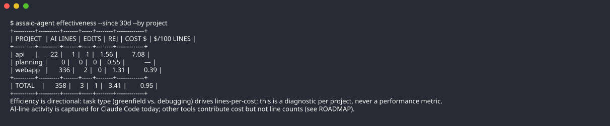

<div align="center">

# assaio

**Is your AI coding spend delivering? `assaio` shows which projects turn AI budget into
code — and where the same spend would go further — fully offline today, across Claude
Code, Codex, Gemini CLI, Copilot CLI, and Cline. The first piece of a self-hosted
AI-engineering analytics platform.**

[](https://github.com/assaio/assaio/actions/workflows/ci.yml)
[](https://goreportcard.com/report/github.com/assaio/assaio)
[](https://pkg.go.dev/github.com/assaio/assaio)
[](LICENSE)
[](https://github.com/assaio/assaio/releases)

[assaio.dev](https://assaio.dev) · [Roadmap](ROADMAP.md) · [Backlog](BACKLOG.md) · [Features](FEATURES.md) · [Privacy](PRIVACY.md) · [Contributing](CONTRIBUTING.md)

</div>

---

Vendor dashboards count tokens and dollars — spend, never output — and each is a per-vendor
silo with weeks-long retention that never adds up across the tools your engineers really
use. `assaio` reads the session logs already sitting on your machine and puts AI output
*over* its cost: per project, how much code AI produced, how efficiently (**`$` per 100 AI
lines** — the headline), and with how much friction. No account, no upload, about 60 seconds.
Cost is the denominator now, not the headline.

<p align="center">
  
</p>

## Privacy first

`assaio` is built to be safe to run on a work machine without asking anyone's
permission. This section describes the **local agent**, which is what runs on your machine
and needs no network at all.

- **No network at runtime.** The price table is embedded into the binary at build time.
  Nothing is fetched, posted, or phoned home.
- **No telemetry.** No usage pings, no analytics, no crash reporting.
- **Prompts and code are never read.** The parsers extract token counts, model names,
  timestamps, session IDs, and activity counts (lines added/removed, edits, rejections) —
  **never prompt text, never file contents.** Line counts come from diff `+`/`-` markers;
  the code on those lines is counted, never stored.
- **Your data stays local.** Everything lives in one SQLite file under your home
  directory. `clear --all --yes` deletes it.

Full detail, including the exact fields extracted: [PRIVACY.md](PRIVACY.md).

**The optional team server** (`serve` + `sync`) pools a team's usage on infrastructure you
stand up. It is the one piece that uses the network — the guarantee above is about the local
analysis. Team views stay aggregated and pseudonymized by default; a per-member view is a
deliberate, governed opt-in, never a surveillance leaderboard.

## Install

`assaio-agent` is a single static binary — no CGO, no runtime dependencies — built for
macOS, Linux, and Windows (amd64/arm64), and the test suite runs in CI on all three.

**Homebrew** (macOS, and Linux via Linuxbrew):

```sh
brew install assaio/tap/assaio-agent
```

**Any platform, with Go 1.25+:**

```sh
go install github.com/assaio/assaio/cmd/assaio-agent@latest
```

Or take your platform's archive straight from
[Releases](https://github.com/assaio/assaio/releases).

<details>
<summary>Manual install recipes — Linux / macOS and Windows</summary>

```sh
VER=$(curl -fsSL https://api.github.com/repos/assaio/assaio/releases/latest |
  sed -n 's/.*"tag_name": *"v\([^"]*\)".*/\1/p')
curl -LO "https://github.com/assaio/assaio/releases/download/v$VER/assaio_${VER}_linux_amd64.tar.gz"
tar xzf "assaio_${VER}_linux_amd64.tar.gz" assaio-agent
sudo install assaio-agent /usr/local/bin/
```

```powershell
$ver = (Invoke-RestMethod https://api.github.com/repos/assaio/assaio/releases/latest).tag_name.TrimStart('v')
Invoke-WebRequest "https://github.com/assaio/assaio/releases/download/v$ver/assaio_${ver}_windows_amd64.zip" -OutFile assaio.zip
Expand-Archive assaio.zip -DestinationPath "$env:LOCALAPPDATA\assaio"
[Environment]::SetEnvironmentVariable("Path", "$([Environment]::GetEnvironmentVariable('Path','User'));$env:LOCALAPPDATA\assaio", "User")
```

New terminal after the `PATH` change; on ARM replace `amd64` with `arm64`. Scoop and winget
packages are on the [backlog](BACKLOG.md).

</details>

Every release artifact ships with checksums and a build-provenance attestation —
verify one with `gh attestation verify <archive> -o assaio`.

New here? `assaio-agent demo` prints the full reports on bundled sample data — no logs
needed — so you can see the value before importing your own history.

## Quick start

The commands below are identical on macOS, Linux, and Windows (PowerShell or cmd) —
each tool's log location is auto-detected per OS, and `assaio-agent doctor` shows
exactly what was found on your machine.

Import your local history, then report on it. The first `backfill` reads every session
log your AI coding tools have written — often months of data.

```console
$ assaio-agent backfill
claude-code   files=3  records=4  inserted=4
codex         files=1  records=1  inserted=1
gemini-cli    files=0  records=0  inserted=0
cline         files=0  records=0  inserted=0
```

First, where the money goes — spend per project:

```console
$ assaio-agent report --since 30d --by project
+----------+--------+--------+-----------+---------+--------+--------+
| PROJECT  |     IN |    OUT |   CACHE R | CACHE W | CACHE% | COST $ |
+----------+--------+--------+-----------+---------+--------+--------+
| api      | 22,680 | 16,800 | 1,664,000 |  38,000 |   98.7 |   1.56 |
| planning |    270 |  7,300 |   430,000 |  24,000 |   99.9 |   0.55 |
| webapp   |  1,720 | 15,000 |   848,000 |  80,000 |   99.8 |   1.31 |
+----------+--------+--------+-----------+---------+--------+--------+
|          |        |        |           |         |  TOTAL |   3.41 |
+----------+--------+--------+-----------+---------+--------+--------+
```

But spend is only half the question. **Which projects turn that spend into code, and
which don't?** That is `effectiveness` — AI output over cost, per project:

```console
$ assaio-agent effectiveness --since 30d --by project
+----------+----------+-------+-----+--------+-------------+
| PROJECT  | AI LINES | EDITS | REJ | COST $ | $/100 LINES |
+----------+----------+-------+-----+--------+-------------+
| api      |       22 |     1 |   1 |   1.56 |        7.08 |
| planning |        0 |     0 |   0 |   0.55 |           — |
| webapp   |      336 |     2 |   0 |   1.31 |        0.39 |
+----------+----------+-------+-----+--------+-------------+
| TOTAL    |      358 |     3 |   1 |   3.41 |        0.95 |
+----------+----------+-------+-----+--------+-------------+
Efficiency is directional: task type (greenfield vs. debugging) drives lines-per-cost; this is a diagnostic per project, never a performance metric.
Not every source records changed lines; the ones that do not contribute cost but no line counts -- run `assaio-agent signals coverage` for what your own data supports.
Cost is an estimate at public pay-as-you-go API prices -- not your actual spend; subscription plans bill a flat rate and differ.
```

The headline column is **`$/100 LINES`** — cost per 100 AI-written lines. Read this table:

- **`webapp`** turns spend into code: greenfield work, 336 AI lines at **`$0.39` per 100
  lines**.
- **`api`** costs **`$7.08` per 100 lines — 18× more.** It is debugging-heavy: many
  tokens spent reading and reasoning, few new lines — so the ratio reads worse.
- **`planning`** shows **`—`**: real cost, zero lines. That is an architecture session,
  not waste — so `assaio` prints an honest blank, never a fake `$0` or a divide-by-zero.

This is a **per-project diagnostic, not a scoreboard.** The ratio is directional: task
type drives lines-per-cost far more than any person does, which is why `assaio` groups by
project here, not by author, by default.

Group by `day`, `project`, `tool`, `model`, or `entrypoint`. Want machine-readable
output? Add `--format json` or `--format csv`. Not sure what was detected? Run
`assaio-agent doctor`.

For the fuller read, `assaio-agent analyze` prints a short directional report for each
metric — adoption, model fit, context health, throughput, rework — and
`assaio-agent dashboard` writes a self-contained, offline HTML dashboard you can open in a
browser or hand to a teammate (project names pseudonymized by default). All of it runs
locally, in about 60 seconds.

### Cost honesty and control

Every `$` assaio prints is an **estimate at public pay-as-you-go API prices** — not your
actual spend. Token counts are computed server-side, and a flat-rate subscription (Claude
Pro/Max, ChatGPT Plus/Pro) makes the effective cost-per-token entirely different, so
assaio labels every cost figure as an estimate. If you pay a subscription or a negotiated
rate, set your real basis in `config.pricing` (an effective `$/token` or a monthly plan
cost) and reports show a truer figure alongside the estimate.

Two commands build on that:

- `assaio-agent check --max-tokens N` (or `--max-cost N`) is an exit-code budget gate for
  CI or a pre-push hook — non-zero when usage exceeds the budget. Token budgets are the
  plan-independent default; a `$` budget is allowed but labeled API-equivalent.
- `assaio-agent report --compare` (and `effectiveness --compare`) shows period-over-period
  **top movers** — which projects' cost and AI lines rose or fell vs. the previous equal
  window.

What comes next — vendor billing reconciliation (estimate vs. real invoice), tiered
pricing, a status-line one-liner — is in [ROADMAP.md](ROADMAP.md).

## What assaio measures — and what it doesn't (yet)

The honest scope. `assaio` measures **how much AI is producing, how efficiently, and with
how much friction** — not *how good the result is*. That line is deliberate; blurring it
would be the easiest way to lie with this tool.

**Measured today** — fully offline, per project / model / tool:

| Dimension | What it is | How it's derived |
|-----------|------------|------------------|
| **Adoption** | Tool mix, sessions, and sub-agent delegation. | Session logs; sub-agent token usage is now counted (it used to be invisible — a correctness fix). |
| **Effect** | AI lines added and removed. | Counted from the `+`/`-` markers in diff hunks. **The code text itself is never read or stored** — only the line counts. |
| **Efficiency** | **`$` per 100 AI lines** — the headline. | Priced cost ÷ AI lines added, shown per 100 lines. Unpriced models stay an honest blank. |
| **Friction** | Edits, and rejections. | Edit/Write tool-calls, plus proposals the human declined (`REJ`). |

**Not measured yet** — these need correlation with your git history and issue tracker, the
**deeper** [server work](ROADMAP.md) still ahead (the team-server MVP that ships today pools
usage; it does not yet reach into your repos):

- Whether AI-written code **survived** in your main branch after review, rewrites, and reverts.
- Whether it **caused bugs**, compared only against age-matched human code.
- Code **quality or maintainability**.

So today's answer is *"how much is AI producing, how efficiently, and with how much
friction"* — a per-project diagnostic. *"Did it actually work, and was it worth it in
quality terms"* is the roadmap.

One more limit is enforced rather than documented: **a figure is computed only over the
sources that record its field.** A tool that never writes an edit count is absent from the
session mix rather than counted as a window full of conversations, the reach is stated as the
verdict's signal coverage, and a figure nothing in your window can answer prints `—` and
withholds its verdict ([ADR 0011](docs/adr/0011-capability-gated-metrics.md)).
`assaio-agent signals coverage` reads your own mix and says what it supports.

## Commands

The ones a first week actually needs: `demo` to see it on sample data, `backfill` to import
your history, `effectiveness` for the headline, `analyze` for the fuller read, `dashboard`
for something to hand a teammate, and `doctor` when a number looks wrong.

<details>
<summary>Every command</summary>

| Command    | What it does |
|------------|--------------|
| `demo`     | Print the full reports on bundled sample data — no logs needed, the 60-second first look. |
| `init`     | First run: show what will be read, import it, write the report, name what to run next. |
| `backfill` | Import all historical local session logs into the store. |
| `report`   | Print a token/cost report. `--since 7d`, `--by day\|project\|tool\|model\|entrypoint\|member`, `--format table\|json\|csv`, `--compare` for period-over-period top movers. |
| `effectiveness` | Print AI output vs. cost — AI lines, edits, rejections, and **`$`/100 AI lines** — per project. Same `--since`, `--by`, `--format`, `--compare` flags (defaults to `--by project`). A directional, per-project diagnostic. |
| `analyze` | Run metric validators — adoption, model fit, context health, throughput, rework, plus any configured [metric plugins](docs/extending.md#write-a-metric-plugin-any-language) — and print each one's directional report, led by the few findings **worth a week's attention** with the reasons that ordered them. A window with nothing worth acting on says so instead of promoting the least weak read. `--since`, `--format text\|json`, `--list`, or pass `[name...]` to run a subset. |
| `check`    | Exit non-zero when usage exceeds a budget — `--max-tokens N` (plan-independent default) or `--max-cost N` (labeled API-equivalent) — or when a configured [rule plugin](docs/extending.md#write-a-rule-plugin-any-language) raises an `error` alert. A CI / pre-push gate. |
| `dashboard` | Write a self-contained, offline **HTML dashboard** — stat tiles, hot/going-stale projects, model/tool mix, inventory. `--since`, `--output`. Project names are pseudonymized by default so it's safe to share; `--no-anonymize` for real names. |
| `serve`    | Run the self-hosted **team server**: collects usage pushed by teammates' `sync` and serves the aggregated, pseudonymized-by-default team dashboard. |
| `sync`     | Push this machine's local usage to a team server — pseudonymous by default, `--member` is an explicit opt-in to a real name. |
| `doctor`   | Show detected tools, log locations, store inventory and size, format-drift canaries, how much of your store the price table cannot cost, and accuracy caveats. `--strict` exits non-zero for cron/CI — including when too much of the store carries no model price for `$` to mean anything (`pricing.max_unpriced_share`, default 5%). |
| `status`   | A terminal overview: inventory, headline `$`/100 lines, hottest projects, and what's going stale — projects only. `--since`. |
| `statusline` | Print **one ambient line** for an editor or shell status bar: today's tokens, AI lines, cost basis, and how fresh the data is. The day is your machine's local day. Read-only, and never fails loudly — see [automation](docs/automation.md#option-c--claude-code-session-hooks-for-statusline). |
| `explain`  | Print a metric's **long-form page** — what it measures, how to read it, what to do about it, and its limits. Needs no store, so it works before your first import; no argument lists every metric. |
| `mark`     | Label a session with what the work actually was — task class, outcome, difficulty. Category values only, never free text, and never sent by `sync`. Defaults to the newest session in the repository you are standing in; `--last`, an id prefix, `--list`, `--unmark`. Every metric can then be read per kind of work. |
| `reconcile` | Compare a vendor's **own billing or usage export** — a CSV or JSON you downloaded, no credential and no network — against assaio's estimate. Computes the scope mismatch first, names only the parts of the delta that have evidence, and reports the rest as **unexplained**. Nothing is ever adjusted to make the two sides agree. `--since`, `--map` to bind columns, `--format text\|json`. See [reconciling](docs/reconcile.md). |
| `signals`  | `list` what assaio can report; `describe <id>` for what one signal counts, where it is honest, and **what a zero means**; `coverage` reads your own store and says which signals your data actually supports, fully, partly, or not at all. |
| `clear`    | Delete stored data — needs an explicit scope (`--all`, `--older-than`, `--tool`, `--labels`) and `--yes`. Session labels survive every scope but `--labels`: no re-import can rebuild them. |
| `compact`  | Reclaim disk space the store freed but still holds — deleting rows alone never shrinks the file. |
| `config`   | Print the effective configuration and where it was loaded from. |
| `plugins`  | `list` configured exec parser plugins; `verify <name>` runs one and reports protocol conformance without storing. |
| `metrics`  | `list` configured exec **metric** plugins; `verify <name>` runs one on your real window and reports contract conformance plus the rendered result — nothing stored. |
| `version`  | Print the version (also `--version`). |

</details>

## Configuration

Configuration is optional — the defaults (`since: 30d`, `format: table`) are sensible.
To override, create `~/.config/assaio/config.yaml` (XDG-aware):

```yaml
since: 30d
format: table
```

Environment variables take precedence over the file, using an `ASSAIO_` prefix:
`ASSAIO_SINCE=7d`, `ASSAIO_FORMAT=json`. Command-line flags win over both. See
[config.example.yaml](config.example.yaml) for a documented starting point.

## Supported tools and accuracy

Today `assaio` reads five sources:

- **Claude Code** — session transcripts under `~/.claude/projects/**/*.jsonl`.
- **OpenAI Codex CLI** — rollout logs under `~/.codex/sessions/**` and
  `~/.codex/archived_sessions/**`.
- **Gemini CLI** — chat logs under `~/.gemini/tmp/<hash>/chats/session-*.jsonl`.
- **GitHub Copilot CLI** — session events under `$COPILOT_HOME`, else
  `~/.copilot/session-state/<id>/events.jsonl`. Totalled when a session ends, so its
  records are session-granularity.
- **Cline** — task data under the VS Code extension's global storage
  (`saoudrizwan.claude-dev`) and the Cline CLI's `~/.cline/data/tasks`.

Costs are computed from a vendored snapshot of the
[LiteLLM](https://github.com/BerriAI/litellm) price table, and `doctor` reports how much of
*your* store that table cannot price rather than leaving you to find out from a figure that
looks complete. We are honest about what we can and cannot measure — `assaio-agent doctor`
prints these caveats every run, so this list is a preview, not the only place it lives:

<details>
<summary>The accuracy caveats <code>doctor</code> prints</summary>

- Claude `input_tokens` can be a streaming placeholder, so totals may diverge slightly
  from the Anthropic Console.
- Codex reasoning tokens are reported separately but assumed to be included in output
  for cost.
- Gemini tool-use tokens are folded into output tokens, and `~/.gemini` may be shared
  with other tools; the mapping is based on observed samples, pending verification
  against more real traces.
- Cline stores its own per-request cost, but `assaio` recomputes cost from tokens for
  cross-tool consistency.
- The price table is flat per model: long-context premiums (e.g. a 1M-context `[1m]`
  rate) and the distinct 5-minute vs 1-hour cache-write rates are not modeled yet, so
  cost for very long-context or heavy-caching sessions is an under-estimate.
- Days and week-over-week windows are bucketed in UTC, so late local-evening work can
  land on the next UTC day.
- Activity counts (AI lines, edits, rework) — not tokens or cost — can be slightly off
  if you back-fill a session while it is still being written; re-running `backfill` after
  it ends does not restate an already-imported turn.
- All on-disk log formats are vendor-internal and may change between tool versions.

</details>

When a model is missing from the price table, `assaio` never fakes a `$0` cost: the
table shows `—`, JSON reports `"cost": null`, CSV leaves the cell empty, the row is
excluded from the `TOTAL`, and the footnote states what share of the window's tokens the
cost could not see. Wrong-but-precise numbers are worse than an honest blank.

More tools (opencode, Aider, Factory droid, Cursor) are on the
[roadmap](ROADMAP.md).

## Adapt it to your organization

`assaio` is built to be adapted, not just installed. Three out-of-tree surfaces need no fork
and no rebuild, each an executable in any language declared in your config: a **parser
plugin** reads another tool's logs, a **metric plugin** renders beside the built-in verdicts,
and a **rule plugin** gates `check` on your own thresholds. In-tree you can add a data source
or a metric validator; outside the binary you can query the documented SQLite schema
directly or pipe `--format json|csv` into your own tooling. The
[extensibility guide](docs/extending.md) has every contract, with a `verify` command per
protocol.

One honest limit: **out-of-tree Go plugins that import `assaio` as a library are not
possible yet.** The core lives under Go's `internal/` on purpose while the API stabilizes.
Exec plugins are the supported path today — their contract is a versioned data format, not a
Go API, so they survive core refactors. An in-process Go API is still ahead; see the
[roadmap](ROADMAP.md).

## Status and roadmap

`assaio` is pre-1.0 and already reaches well past an offline token reporter: five parsers,
nineteen metric validators that each carry a confidence envelope, format-drift canaries, a
published source-depth matrix, offline reconciliation against a vendor's own export, the
offline **Assay** dashboard, and a self-hosted team-server MVP.
[FEATURES.md](FEATURES.md) is the maintained inventory, with the release each capability
arrived in.

What it still can't do is connect a session to the change it produced — whether AI-written
code reached a pull request, passed review and CI, **survived** in `main`, or **caused
bugs**. That needs correlating usage with git and pull-request history, and it is the next
milestone, not a shipped feature. [ROADMAP.md](ROADMAP.md) is that direction as a
feedback-driven plan, never a committed schedule; [BACKLOG.md](BACKLOG.md) is the ranked
pool behind it.

The core is Apache-2.0 and stays that way; a hosted or enterprise offering may fund
development later.

## Why "assaio"?

An *assay* is the metallurgist's test: what tells you how much real metal is in a piece of
ore. Ore can glitter and still be worthless — which is exactly the position engineering
organizations are in with AI coding tools: tokens burned, seats bought, dashboards full of
activity, and very little honest measurement of what any of it is worth. **assaio** (*assay*
+ *io*) is built to be that test, and it would rather show you an honest blank than a
precise-looking number that is wrong.

The metaphor also sets the ethics: an assay examines the metal, never the miner. assaio
measures **value, not people** — aggregation and pseudonymization are the defaults in
everything built on this agent.

## Contributing

Contributions are welcome. Please read [CONTRIBUTING.md](CONTRIBUTING.md) first — it is
the authoritative set of rules. In short: sign your commits with the
[DCO](https://developercertificate.org/) (`git commit -s`), one commit per PR
(squash before review), Conventional Commit subjects, and a green CI gate (`gofmt`,
`go vet`, `golangci-lint`, `go test -race`).

AI assistants get the same rules via [AGENTS.md](AGENTS.md). Adding support for a new AI tool
is a well-scoped first contribution: one parser package, golden-file tests, and a connector
issue template to guide you — the [extensibility guide](docs/extending.md) walks it through.

## Security

Found a vulnerability? Do not open a public issue — see [SECURITY.md](SECURITY.md) for
private disclosure.

## License

Apache-2.0 — see [LICENSE](LICENSE). `assaio` embeds a snapshot of the model price table
from the LiteLLM project (MIT); attribution is in [NOTICE](NOTICE).

## Partner with us

assaio is at the beginning of its roadmap, and the most valuable thing at this stage is
real-world usage.

- **Pilot organizations & design partners.** If your team wants to see what its AI coding
  spend produces per project today — and, next, whether that code survives and holds up in
  quality terms — we want to build the [next milestone](ROADMAP.md) against your reality,
  not our assumptions. Direct influence on the roadmap; no commitment beyond honest feedback.
- **Tool vendors & integrators.** If you build an AI coding tool and want it measured
  fairly, help us get your connector right.
- **Anyone running Gemini CLI or Cline.** One redacted session log closes the one gap
  nothing here can close alone: both are calibrated against a sample written in the source's
  shape, never a real capture. A redacted vendor billing export is the same kind of gift.
- **Contributors.** One tool = one package; one metric = one file. The codebase is
  deliberately small and readable — a good place to make your first open-source
  contribution count.

Talk to us: [GitHub Discussions](https://github.com/assaio/assaio/discussions) ·
[karauda.com/contact](https://karauda.com/contact) · [assaio.dev](https://assaio.dev)
